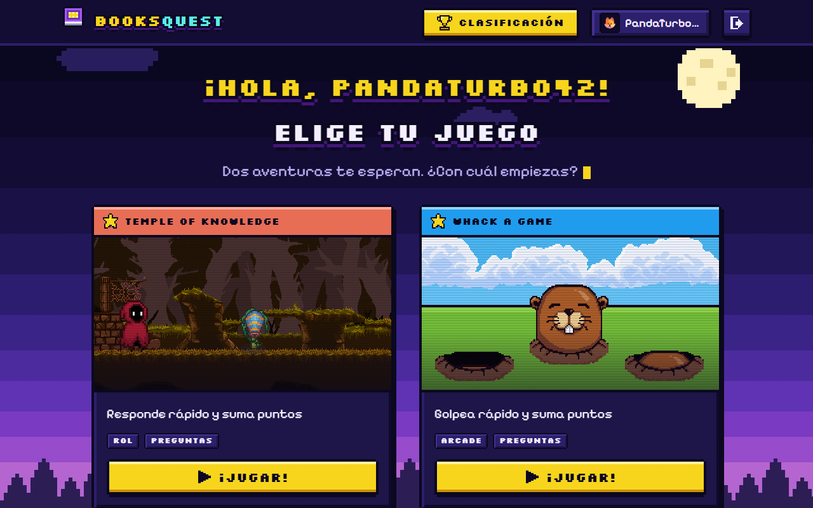

# 🕹️ BooksQuest

Plataforma de minijuegos educativos: los jugadores entran con un nombre, reciben un código de
acceso y juegan dos minijuegos de preguntas (**Temple of Knowledge** y **Whack a game**) para sumar
puntos y subir en la tabla de clasificación. Incluye un panel de administración para proyectar el
ranking en el salón y gestionar jugadores.



## 🎨 Diseño

Identidad **noche estrellada + pixel-art**: marcos con esquinas cortadas, sombras duras sin
difuminar y movimiento por cuadros, armada con el arte real de los juegos (sprites y fondos de
`public/assets`). Guía completa, paleta, componentes y cómo extenderla:
**[docs/design-system.md](docs/design-system.md)**.

## 🧩 Stack

- [TanStack Start](https://tanstack.com/start) (React 19) con enrutamiento por archivos
  (`src/routes/`) y SSR vía [Nitro](https://nitro.build/).
- [Tailwind CSS v4](https://tailwindcss.com/) + componentes [shadcn/ui](https://ui.shadcn.com/)
  adaptados al sistema de diseño pixel (`src/components/ui/`).
- [Phaser 3](https://phaser.io/) para los dos minijuegos (`src/components/games/`).
- [TanStack Query](https://tanstack.com/query) para todo el estado remoto (usuarios, puntajes,
  clasificación, admin).
- Capa `src/core/` en arquitectura limpia (domain → application → infrastructure) que encapsula
  toda la comunicación con el backend. Nada fuera de `src/core/infrastructure` hace `fetch`.

## 🚀 Empezar

Necesitas Node.js y npm — [instálalos con nvm](https://github.com/nvm-sh/nvm#installing-and-updating).

```sh
git clone <url-de-este-repositorio>
cd game-hub
npm i
```

Crea un archivo `.env` en la raíz con la URL base del backend:

```sh
# .env
VITE_API_URL=https://tu-backend.example.com/api
```

Sin esta variable la app arranca igual, pero cualquier llamada al backend (login, registro,
puntajes, clasificación, admin) falla con un error explicando que falta configurarla.

```sh
npm run dev
```

## 📜 Scripts

| Comando             | Qué hace                                               |
| ------------------- | ------------------------------------------------------ |
| `npm run dev`       | Servidor de desarrollo con recarga en caliente.        |
| `npm run build`     | Build de producción (SSR) en `.output/`.               |
| `npm run build:dev` | Build en modo desarrollo (útil para depurar el build). |
| `npm run preview`   | Sirve el build de producción localmente.               |
| `npm run lint`      | ESLint sobre todo el proyecto.                         |
| `npm run format`    | Prettier `--write` sobre todo el proyecto.             |

## 🗂️ Estructura

```
src/
  routes/              Páginas (enrutamiento por archivos de TanStack Start)
    index.tsx            Menú — elegir juego
    temple-of-knowledge.tsx, whack-a-question.tsx
    admin/                Panel de administración (login, usuarios, clasificación)
    __root.tsx            Layout único: resuelve el perfil del jugador y pinta el header
  components/
    games/               Los dos minijuegos (Phaser), cada uno en su propia carpeta
    pixel/               Sistema de diseño: íconos, sprites, cielo/suelo, logo, escenas
    ui/                  Primitivos shadcn ya adaptados al pixel-art
    admin/                Header y guard de sesión del panel de administración
  core/                 Arquitectura limpia: domain/ · application/ · infrastructure/
  lib/                  Perfil del jugador (localStorage), sesión admin, utilidades
docs/
  design-system.md      Guía del sistema de diseño
scripts/
  generate-favicon.mjs  Genera favicon.svg/.ico y apple-touch-icon.png desde el logo pixel
```

## 🧭 Rutas

| Ruta                   | Qué es                                                           |
| ---------------------- | ---------------------------------------------------------------- |
| `/`                    | 🏠 Menú: elegir juego (requiere perfil de jugador).              |
| `/temple-of-knowledge` | ⚔️ Minijuego de preguntas estilo RPG.                            |
| `/whack-a-question`    | 🔨 Minijuego de golpear al topo con la respuesta correcta.       |
| `/admin/login`         | 🔐 Ingreso del panel de administración.                          |
| `/admin`               | 🛠️ Panel: accesos a clasificación y usuarios.                    |
| `/admin/users`         | 👥 Jugadores registrados: código de acceso, reinicio de puntaje. |
| `/admin/leaderboard`   | 🏆 Clasificación en grande, pensada para proyectar en el salón.  |

Un jugador nuevo escribe su nombre, recibe un código de acceso y puede volver a entrar con
nombre + código más tarde (ver `UsernameGate`). Cada juego se puntúa una sola vez; el puntaje de
cada uno vive en `perfil.scores` (ver `usePerfil`).

## ☁️ Despliegue

Build SSR servido con [PM2](https://pm2.keymetrics.io/) detrás de nginx, bajo el prefijo
`/game-hub/` (ver `base` en `vite.config.ts`):

```sh
npm run build
cp ecosystem.config.template.js ecosystem.config.js   # y ajusta cwd/PORT
pm2 start ecosystem.config.js
```

`ecosystem.config.js` requiere un `.env` en el mismo directorio (`cwd`) con `VITE_API_URL`.
